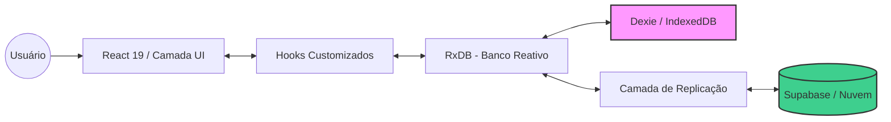
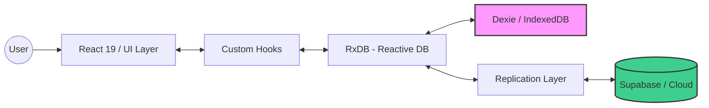

# 🐄 INDI Ouro App

> **PWA Offline-First de nível corporativo para gestão de rebanhos bovinos.**
> **Enterprise-grade Offline-First PWA for Cattle Herd Management.**

[](https://nextjs.org/)
[](https://react.dev/)
[](https://www.typescriptlang.org/)
[](https://rxdb.info/)
[](https://supabase.com/)

---

# 🇧🇷 Versão em Português

## 📖 Visão do Projeto e Contexto

O **INDI Ouro App** é um sistema de gestão especializado projetado para a **Nelore INDI OURO**, uma operação de pecuária de alto desempenho. Este projeto nasceu da necessidade de uma solução robusta e orientada a dados que funcione nas realidades remotas das fazendas rurais.

### A Jornada de Engenharia
- **Desenvolvimento Iterativo**: Desenvolvido em múltiplos sprints com sincronizações semanais com o cliente.
- **Centrado no Usuário**: Cada funcionalidade foi validada no ambiente real da fazenda.
- **Qualidade em Primeiro Lugar**: Foco em tipagem segura, padrões de dados reativos e UI/UX premium.

---

## 🏗️ Arquitetura Técnica

A aplicação segue uma filosofia **Local-First / Offline-First**, garantindo 100% de funcionalidade independentemente do estado da rede.

### 🔄 Fluxo de Dados e Sincronização



**Principais Características da Arquitetura:**
- **Persistência Local**: RxDB com Dexie (IndexedDB) para armazenamento robusto no navegador.
- **Sincronização em Nuvem**: Replicação bidirecional em tempo real com Supabase (PostgreSQL).
- **Resolução de Conflitos**: Last-Write-Wins baseado em timestamps `updated_at`.
- **Reatividade**: A UI é um reflexo direto do estado do banco; qualquer mudança dispara atualizações imediatas.

---

## 🚀 Stack Tecnológica

| Camada | Tecnologias | Versão |
|:---|:---|:---:|
| **Framework** | Next.js (App Router, Turbopack) | 16.0.8 |
| **Linguagem** | TypeScript | 5 |
| **UI/Frontend** | React, Tailwind CSS, Radix UI, Framer Motion | 19.2 / 4 / - / 12 |
| **Banco Local** | RxDB + Dexie (IndexedDB) | 16.20 |
| **Nuvem/Backend** | Supabase (PostgreSQL + Storage + Auth) | - |
| **Validação** | Zod | 4.3 |
| **PDF/Excel** | jsPDF, jsPDF-AutoTable, XLSX | 3 / 5 / 0.18 |
| **Gráficos** | Recharts | 2.15 |
| **Ícones** | Lucide React | 0.543 |
| **Mobile (PWA)** | Capacitor | 7.4 |

---

## 📋 Requisitos

### ✅ Requisitos Funcionais

| Módulo | Funcionalidades |
|:---|:---|
| **Registro de Animais** | Cadastro completo com pedigree, genética, RGN/RGD, defeitos, classificação e genotipagem. |
| **Biometria** | Pesagens e Circunferência Escrotal (CE) com histórico e gráficos de evolução. |
| **Reprodução** | Acompanhamento de matrizes (doadoras, reprodutoras, receptoras FIV), partos e eventos reprodutivos. |
| **Vacinas** | Gestão de calendário vacinal com tipos customizáveis e histórico de aplicações. |
| **Movimentações** | Controle de nascimentos, mortes, vendas e trocas de animais. |
| **Comercial** | Gestão de vendas, clientes, métodos de pagamento (À Vista, Boleto) e status financeiro. |
| **Relatórios** | Geração dinâmica de PDFs e Excel com filtros personalizáveis. |
| **Doses de Sêmen** | Controle de estoque, lotes, touros e uso de doses. |
| **Fazendas/Sociedades** | Gestão de propriedades e parcerias. |

### 🛡️ Requisitos Não Funcionais

| Categoria | Especificação |
|:---|:---|
| **Confiabilidade Offline** | Funcionalidade 100% garantida sem conexão. |
| **Performance** | Responsividade de UI < 100ms via consultas local-first. |
| **Estética Premium** | Design system moderno com glassmorphism, micro-animações e transições suaves. |
| **Acessibilidade** | Suporte a usuários com diferentes níveis de letramento. Componentes Radix UI acessíveis. |
| **Segurança** | Dados locais no dispositivo, sync com Supabase RLS (Row Level Security). |

---

## 📂 Estrutura de Pastas do Projeto

```
rico-ouro-app/
├── public/                          # Arquivos estáticos e Service Worker (sw.js)
├── src/
│   ├── app/                           # Next.js App Router
│   │   ├── (protected)/               # Rotas protegidas (requer auth)
│   │   │   ├── animals/               # Detalhes e edição de animais
│   │   │   ├── cadastro/              # Cadastro de novos animais
│   │   │   ├── calendario/            # Calendário de eventos
│   │   │   ├── comercial/             # Módulo comercial (vendas, clientes)
│   │   │   ├── consulta/              # Busca e consulta rápida
│   │   │   ├── geral/                 # Dados gerais e importação
│   │   │   ├── gerenciar/             # Gerenciar vacinas, fazendas, status
│   │   │   ├── movimentacoes/         # Movimentações (nascimento, morte, venda, troca)
│   │   │   ├── nascimentos/           # Registro de nascimentos
│   │   │   ├── pesagem-ce/            # Pesagens e CE
│   │   │   ├── reproducao/            # Eventos reprodutivos
│   │   │   └── vacinas/               # Aplicação de vacinas
│   │   ├── home/                      # Página inicial pública
│   │   ├── login/                     # Autenticação
│   │   ├── globals.css                # Estilos globais
│   │   └── layout.tsx                 # Layout raiz
│   │
│   ├── components/                    # Componentes React reutilizáveis
│   │   ├── auth/                      # Componentes de autenticação
│   │   ├── buttons/                   # Botões customizados
│   │   ├── calendar/                  # Componentes de calendário
│   │   ├── cards/                     # Cards de exibição
│   │   ├── charts/                    # Gráficos Recharts
│   │   ├── clients/                   # Gestão de clientes
│   │   ├── commercial/                # Componentes comerciais
│   │   ├── doses/                     # Gestão de doses de sêmen
│   │   ├── farms/                     # Gestão de fazendas
│   │   ├── layout/                    # Header, Footer, Navigation
│   │   ├── lists/                     # Componentes de listagem
│   │   ├── manage/                    # Componentes de gerenciamento
│   │   ├── modals/                    # 26 modais de ações e edição
│   │   ├── movements/                 # Formulários de movimentação
│   │   ├── relatorios/                # Componentes de relatórios
│   │   ├── reports/                   # Geração de relatórios
│   │   ├── search/                    # Componentes de busca
│   │   ├── situation/                 # Status de situação documental
│   │   ├── skeletons/                 # Loading skeletons
│   │   ├── sociedade/                 # Parcerias/Sociedades
│   │   ├── status/                    # Status dos animais
│   │   ├── sync/                      # Indicadores de sincronização
│   │   ├── ui/                        # 18 componentes base (Radix primitives)
│   │   └── vaccines/                  # Componentes de vacinas
│   │
│   ├── db/                            # Camada de Dados (RxDB)
│   │   ├── schemas/                   # 13 definições de coleções RxDB
│   │   │   ├── animal.schema.ts
│   │   │   ├── animal_metric_ce.schema.ts
│   │   │   ├── animal_metric_weight.schema.ts
│   │   │   ├── animal_situation.schema.ts
│   │   │   ├── animal_status.schema.ts
│   │   │   ├── animal_vaccines.type.ts
│   │   │   ├── client.schema.ts
│   │   │   ├── farm.schema.ts
│   │   │   ├── movement.schema.ts
│   │   │   ├── reproduction_event.schema.ts
│   │   │   ├── sale.schema.ts
│   │   │   ├── semen_dose.schema.ts
│   │   │   └── vaccine.schema.ts
│   │   ├── replication/               # Lógica de replicação por coleção (13 módulos)
│   │   │   ├── animal.replication.ts
│   │   │   ├── animalVaccine.replication.ts
│   │   │   ├── client.replication.ts
│   │   │   ├── farm.replication.ts
│   │   │   ├── metric.replication.ts
│   │   │   ├── movement.replication.ts
│   │   │   ├── reproduction.replication.ts
│   │   │   ├── sale.replication.ts
│   │   │   ├── semenDose.replication.ts
│   │   │   ├── situation.replication.ts
│   │   │   ├── status.replication.ts
│   │   │   ├── vaccine.replication.ts
│   │   │   └── base/                  # Templates base de replicação
│   │   ├── client.ts                  # Inicialização do RxDB
│   │   ├── collections.ts             # Definição de tipos das coleções
│   │   └── replication.ts             # Setup principal de replicação
│   │
│   ├── hooks/                         # Custom Hooks React
│   │   ├── auth/                      # Hooks de autenticação
│   │   ├── core/                      # Hooks utilitários core
│   │   ├── db/                        # 52 hooks de banco de dados
│   │   ├── doses/                     # Hooks de doses de sêmen
│   │   ├── matrizes/                  # Hooks de matrizes
│   │   ├── sync/                      # Hooks de status de sincronização
│   │   └── utils/                     # Hooks utilitários
│   │
│   ├── lib/                           # Bibliotecas e configurações
│   │   ├── auth/                      # Utilitários de autenticação
│   │   ├── rsc/                       # React Server Components utils
│   │   ├── supabase/                  # Cliente Supabase
│   │   ├── backgroundSync.ts          # Lógica de sync em background
│   │   └── utils.ts                   # Utilitários gerais
│   │
│   ├── providers/                     # Context Providers React
│   │   ├── RxDBProvider.tsx           # Provider do banco de dados
│   │   ├── ReplicationProvider.tsx    # Provider de sincronização
│   │   └── LocalFirstProvider.tsx     # Wrapper local-first
│   │
│   ├── types/                         # 16 definições de tipos TypeScript
│   │   ├── animal.type.ts             # Modelo completo de Animal (RGN, pedigree, genética)
│   │   ├── animal_metrics.type.ts     # Métricas (peso, CE)
│   │   ├── calendar.types.ts          # Tipos de calendário
│   │   ├── client.type.ts             # Modelo de Cliente
│   │   ├── farm.type.ts               # Modelo de Fazenda
│   │   ├── movement.type.ts           # Movimentações (nascimento, morte, venda, troca)
│   │   ├── reproduction_event.type.ts # Eventos reprodutivos
│   │   ├── sale.type.ts               # Modelo de Venda
│   │   ├── semen_dose.type.ts         # Modelo de Dose de Sêmen
│   │   ├── situation.type.ts          # Situação documental
│   │   ├── status.type.ts             # Status do animal
│   │   ├── vaccine.type.ts            # Modelo de Vacina
│   │   └── ...                        # Outros tipos auxiliares
│   │
│   ├── utils/                         # Funções utilitárias
│   ├── constants/                     # Constantes da aplicação
│   └── sw/                            # Service Worker customizado
│       └── service-worker.ts          # Cache e sync offline
│
├── package.json
├── next.config.ts
├── tsconfig.json
└── README.md
```

---

# 🇺🇸 English Version

## 📖 Project Vision & Context

The **INDI Ouro App** is a specialized management system designed for **Nelore INDI Ouro**, a high-performance cattle breeding operation. This project was born from the need for a robust, data-driven solution that works in the remote realities of rural farms.

### The Engineering Journey
- **Iterative Development**: Built across multiple sprints with weekly client syncs.
- **User-Centric**: Every feature was validated in the actual farm environment.
- **Quality First**: Focus on type safety, reactive data patterns, and premium UI/UX.

---

## 🏗️ Technical Architecture

The app follows a **Local-First / Offline-First** philosophy, ensuring 100% functionality regardless of network state.

### 🔄 Data Flow & Synchronization



**Key Architectural Features:**
- **Local Persistence**: RxDB with Dexie (IndexedDB) for robust browser storage.
- **Cloud Sync**: Real-time bidirectional replication with Supabase (PostgreSQL).
- **Conflict Resolution**: Last-Write-Wins based on `updated_at` timestamps.
- **Reactivity**: The UI directly reflects the database state; any change triggers immediate UI updates.

---

## 🚀 Technology Stack

| Layer | Technologies | Version |
|:---|:---|:---:|
| **Framework** | Next.js (App Router, Turbopack) | 16.0.8 |
| **Language** | TypeScript | 5 |
| **UI/Frontend** | React, Tailwind CSS, Radix UI, Framer Motion | 19.2 / 4 / - / 12 |
| **Local Database** | RxDB + Dexie (IndexedDB) | 16.20 |
| **Cloud/Backend** | Supabase (PostgreSQL + Storage + Auth) | - |
| **Validation** | Zod | 4.3 |
| **PDF/Excel** | jsPDF, jsPDF-AutoTable, XLSX | 3 / 5 / 0.18 |
| **Charts** | Recharts | 2.15 |
| **Icons** | Lucide React | 0.543 |
| **Mobile (PWA)** | Capacitor | 7.4 |

---

## 📋 Requirements

### ✅ Functional Requirements

| Module | Features |
|:---|:---|
| **Animal Registry** | Complete registration with pedigree, genetics, RGN/RGD, defects, classification, and genotyping. |
| **Biometrics** | Weights and Scrotal Circumference (SC) with history and evolution charts. |
| **Reproduction** | Tracking of matrices (donors, breeders, IVF recipients), calvings, and reproductive events. |
| **Vaccines** | Vaccine schedule management with customizable types and application history. |
| **Movements** | Control of births, deaths, sales, and animal trades. |
| **Commercial** | Sales management, clients, payment methods, and financial status. |
| **Reports** | Dynamic PDF and Excel generation with customizable filters. |
| **Semen Doses** | Stock control, batches, bulls, and dose usage. |
| **Farms/Partnerships** | Property and partnership management. |

### 🛡️ Non-Functional Requirements

| Category | Specification |
|:---|:---|
| **Offline Reliability** | 100% guaranteed functionality without connection. |
| **Performance** | UI responsiveness < 100ms via local-first queries. |
| **Premium Aesthetics** | Modern design system with glassmorphism, micro-animations, and smooth transitions. |
| **Accessibility** | Support for users of varying literacy levels. Accessible Radix UI components. |
| **Security** | Local data on device, Supabase sync with RLS (Row Level Security). |

---

## 📂 Project Folder Structure

```
rico-ouro-app/
├── public/                          # Static assets & Service Worker (sw.js)
├── src/
│   ├── app/                           # Next.js App Router
│   │   ├── (protected)/               # Protected routes (require auth)
│   │   │   ├── animals/               # Animal details and editing
│   │   │   ├── cadastro/              # New animal registration
│   │   │   ├── calendario/            # Event calendar
│   │   │   ├── comercial/             # Commercial module (sales, clients)
│   │   │   ├── consulta/              # Quick search and lookup
│   │   │   ├── geral/                 # General data and import
│   │   │   ├── gerenciar/             # Manage vaccines, farms, status
│   │   │   ├── movimentacoes/         # Movements (birth, death, sale, trade)
│   │   │   ├── nascimentos/           # Birth records
│   │   │   ├── pesagem-ce/            # Weights and SC
│   │   │   ├── reproducao/            # Reproductive events
│   │   │   └── vacinas/               # Vaccine application
│   │   ├── home/                      # Public landing page
│   │   ├── login/                     # Authentication
│   │   └── layout.tsx                 # Root layout
│   │
│   ├── components/                    # Reusable React components (30 folders)
│   ├── db/                            # Data Layer (RxDB)
│   │   ├── schemas/                   # 13 RxDB collection definitions
│   │   ├── replication/               # 13 replication modules
│   │   ├── client.ts                  # RxDB initialization
│   │   └── replication.ts             # Main replication setup
│   │
│   ├── hooks/                         # Custom React Hooks (52 db hooks)
│   ├── lib/                           # Libraries and configurations
│   ├── providers/                     # React Context Providers
│   ├── types/                         # 16 TypeScript type definitions
│   ├── utils/                         # Utility functions
│   ├── constants/                     # Application constants
│   └── sw/                            # Custom Service Worker
│
├── package.json
├── next.config.ts
└── tsconfig.json
```

---

## ⚙️ Development Setup

### Prerequisites
- Node.js 18+
- npm, yarn, pnpm, or bun

### Installation and Execution

```bash
# Clone the repository
git clone https://github.com/[user]/rico-ouro-app.git
cd rico-ouro-app

# Install dependencies
npm install

# Configure environment variables
# Create a .env.local file with Supabase credentials

# Run in development mode
npm run dev

# Build Service Worker
npm run build:sw

# Production build
npm run build
```

---

## 👨‍💻 Author

Developed by Dev Paulo Bruno M Dias

---
*Private Enterprise Project © 2025 - Nelore Indi Ouro*
