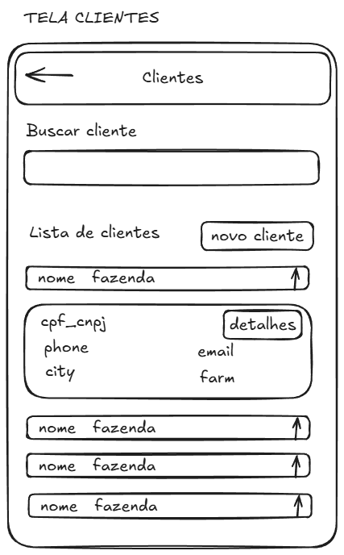
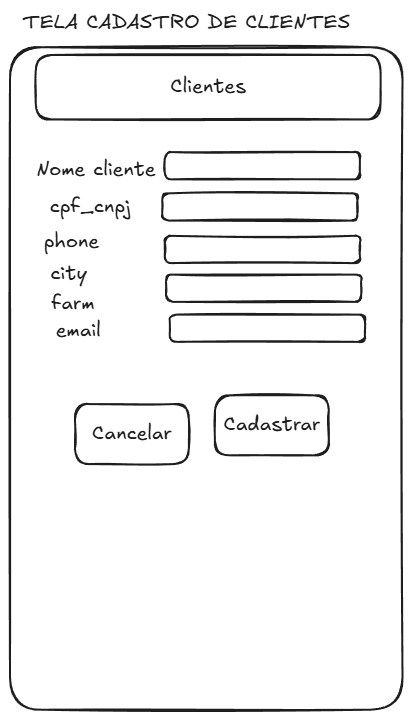
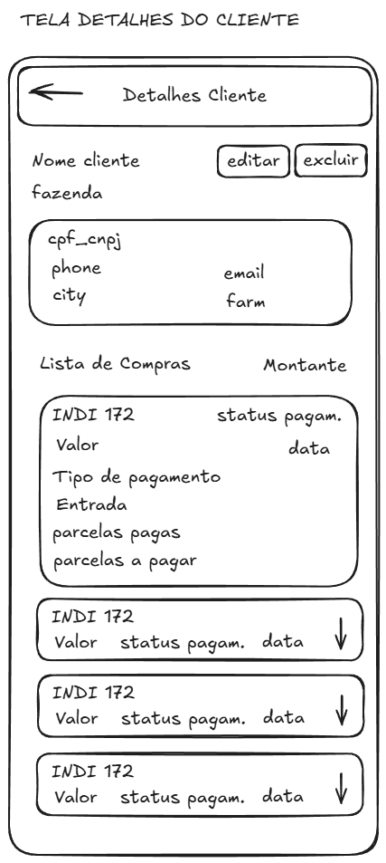
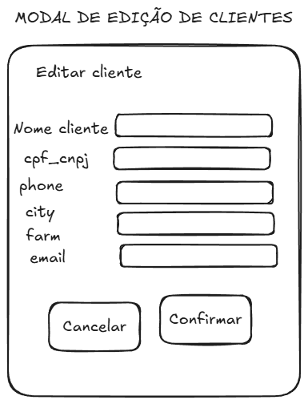
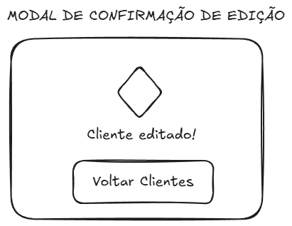

# Documentação Técnica: Gestão de Clientes

Este documento detalha o funcionamento, arquitetura e componentes da funcionalidade de Clientes no sistema Indi Ouro.

## 1. Requisitos da Funcionalidade

- **Criação de Clientes**: Formulário para cadastrar novos clientes.
- **Edição de Clientes**: Atualização de dados de clientes existentes.
- **Listagem de Clientes**: Visualização de todos os clientes cadastrados em ordem alfabética.
- **Busca**: Filtragem de clientes em tempo real por nome ou CPF/CNPJ (parcial ou completo). A busca é insensível a maiúsculas/minúsculas e utiliza operadores regex no RxDB para garantir reatividade e performance.
- **Detalhes**: Visualização detalhada das informações de um cliente específico.
- **Exclusão**: Remoção lógica (soft delete) do cliente.
- **Sincronização Offline**: Armazenamento local no RxDB com replicação bidirecional para o Supabase.

## 2. Estrutura de Pastas Sugerida

```text
src/
├── types/
│   └── client.type.ts            # Definições de tipos (TypeScript)
├── db/
│   ├── schemas/
│   │   └── client.schema.ts      # Esquema JSON do RxDB
│   └── replication/
│       └── client.replication.ts # Configuração de replicação Supabase
├── hooks/
│   └── useClients.ts             # Hook customizado para operações de clientes
├── components/
│   └── clients/                  # Componentes específicos da funcionalidade
│       ├── ClientForm.tsx        # Formulário de cadastro/edição
│       ├── ClientList.tsx        # Lista de clientes
│       ├── ClientListItem.tsx    # Item individual da lista
│       ├── ClientDetails.tsx     # Detalhes do cliente
│       ├── ClientModals.tsx      # Modais de confirmação
│       ├── BuyList.tsx           # Lista de compras do cliente
│       └── BuyListItem.tsx       # Item individual da lista de compras do cliente
└── app/
    └── (protected)/
            └── clientes/         # Rotas da funcionalidade
                ├── page.tsx      # Página principal (Listagem, Detalhes e Edição)
                └── novo/
                    └── page.tsx  # Página de novo cliente
```

## 3. Banco de Dados e Modelagem

### Esquema no Supabase (PostgreSQL)

A tabela `clients` segue o esquema abaixo:

- `id`: uuid (Primary Key)
- `name`: text (Required)
- `cpf_cnpj`: text (Required)
- `inscricao_estadual`: text
- `phone`: text
- `farm`: text
- `city`: text
- `email`: text
- `updated_at`: timestamp with time zone
- `_deleted`: boolean

### Esquema RxDB (Local)

O esquema será idêntico para garantir a sincronia, utilizando o `id` (uuid) como `primaryKey`.

## 4. Componentes a Criar

| `ClientList` | Exibe a lista de clientes com barra de busca. | `onSelectClient: (id) => void` |
| `ClientListItem` | Card resumido do cliente para a lista. | `client: Client`, `onSelect: () => void` |
| `ClientForm` | Formulário reutilizável para Novo/Editar. | `initialData?: Client`, `onSubmit: (data) => void` |
| `ClientDetails` | Exibe todos os dados e botões de ação (Editar/Excluir). | `client: Client`, `onEdit`, `onDelete` |
| `ConfirmationModal` | Modal genérico para confirmações (Exclusão/Sucesso). | `title`, `message`, `onConfirm`, `isOpen` |
| `BuyList` | Exibe a lista de compras do cliente. | `clientId: string` |
| `BuyListItem` | Item individual da lista de compras do cliente. | `buy: Buy` |

## 5. Hooks e Context API

### `useClients` Hook

Responsável por encapsular a lógica de acesso ao banco de dados RxDB:

- `clients`: Array de clientes ativos (`_deleted: false`).
- `loading`: Estado de carregamento.
- `createClient(data)`: Função para inserir no RxDB.
- `updateClient(id, data)`: Função para atualizar.
- `deleteClient(id)`: Função para marcar como `_deleted: true`.
- `searchClients(query)`: Filtro por texto.
- `showBuyList(id)`: Função para mostrar a lista de compras do cliente.

## 6. Fluxo de Navegação (Baseado no Mockup)

1. **Tela Clientes (Modo Lista)**: Listagem de Clientes + Botão "Novo Cliente" + Busca.
2. **Tela Cadastro**: Acessada via `/novo`. Formulário -> Modal de Confirmação -> Retorno para Lista de Clientes.
3. **Tela Clientes (Modo Detalhes)**: Ativada por estado. Dados do Cliente + Lista de compras + Botão Editar + Botão Excluir + Botão Voltar.
4. **Modal Exclusão Cliente**: Confirmar -> Soft Delete -> Reseta estado para Lista.
5. **Tela Clientes (Modo Edição)**: Ativada por estado. Formulário -> Salvar -> Modal de Sucesso -> Retorno para Detalhes.

## 7. Funções Principais

- `upsertClient`: Função única para tratar criação e atualização no banco.
- `formatClientData`: Helper para sanitizar dados (remover máscaras de CPF, etc).
- `validateClient`: Regras de negócio para impedir cadastros duplicados (mesmo CPF).
- `showBuyList`: Função para mostrar a lista de compras do cliente.
- `searchClients`: Implementa a lógica de filtragem utilizando `$or` e `$regex` (em `name` e `cpf_cnpj`) com a opção `$options: "i"`, permitindo buscas flexíveis e rápidas.
- **Sincronização com Timestamps**: O envio do campo `updated_at` para o Supabase é obrigatório para evitar disparidades de precisão entre o relógio local e o servidor, prevenindo loops de conflito ("Local wins").

## 8. Componentes

1. `ClientList`: Lista de clientes com barra de busca.

2. `ClientListItem`: Item individual da lista de clientes.
   Usar accordion para mostrar os cards de clientes listados.
   Card deve conter:

- Nome (Título do accordion)
- CPF/CNPJ
- Telefone
- Email
- Cidade
- Fazenda (Se houver, título do accordion)
- Inscrição estadual
- Botão Detalhes

3. `ClientForm`: Formulário para cadastro e edição de clientes.
4. `ClientDetails`: Detalhes do cliente, incluindo lista de compras.
5. `ConfirmationModal`: Modal de confirmação para exclusão e sucesso.
6. `BuyList`: Lista de compras do cliente.
   Listar compras do cliente por ordem cronológica.
7. `BuyListItem`: Item individual da lista de compras do cliente.
   Usar accordion para mostrar as compras do cliente.
   - Animal (RGN)
   - Data
   - Valor
   - Tipo de pagamento
   - Status
   - Entrada
   - Parcelas a pagar
   - Parcelas pagas

Primeiro card de items deve ter acordion aberto, e os demais fechados.

Criar um array de compras do cliente mockado, em um arquivo .ts separado na pastas constants/, para mostrar na lista de compras do cliente.

### 9 Wireframes

1. Telas de clientes
   

2. Tela de cadastro de clientes
   

3. Tela de detalhes de clientes
   

4. Modal de sucesso de cadastro de clientes
   

5. Modal de exclusão de clientes
   

6. Modal de edição de clientes
   

7. Modal de sucesso de edição de clientes
   
